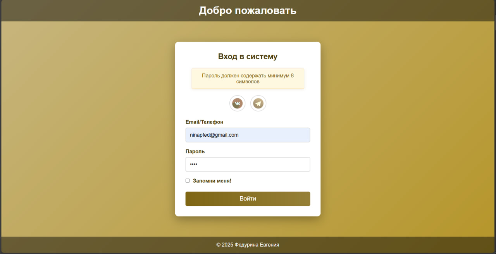
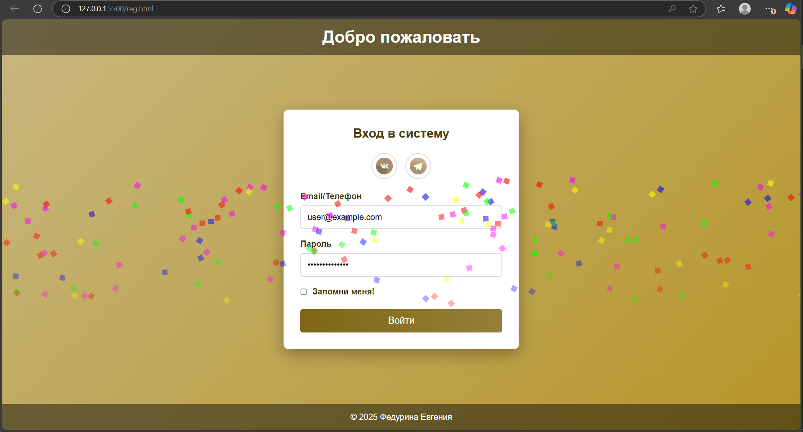
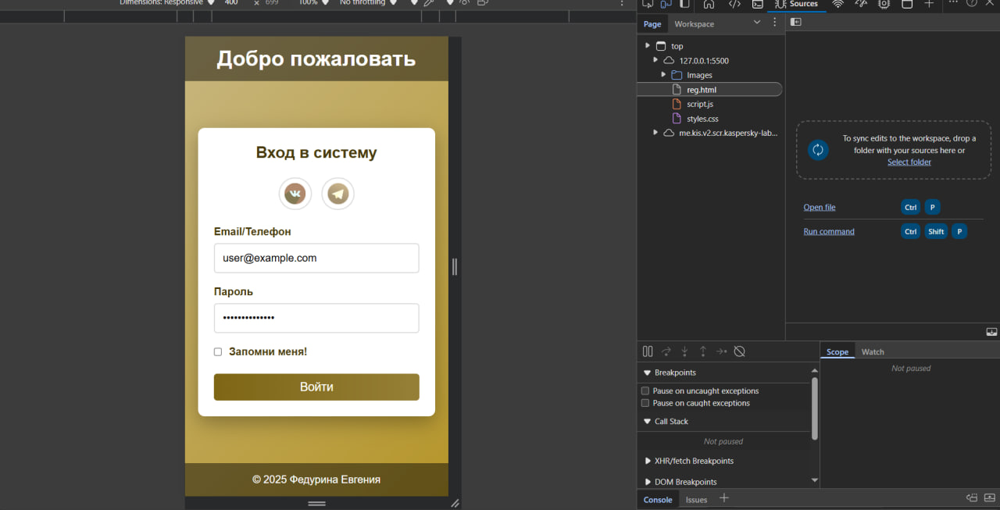

# Web

# README: Сквозной проект - Интерактивная форма авторизации

## Структура проекта
```
/
├── native/                  # Реализация на нативных технологиях
│   ├── index.html           # Основной HTML-файл
│   ├── styles.css           # Стили формы
│   ├── script.js            # Логика формы
│   └── images/              # Изображения для кнопок соцсетей
├── with-infrastructure/     # Будущая реализация с инфраструктурой
├── framework/               # Будущая реализация с фреймворком
└── README.md                # Инструкции и документация
```

## Инструкции по запуску
1. Клонируйте репозиторий:
   ```bash
   git clone https://github.com/fedurina/Web.git
   ```
2. Перейдите в папку с нативной реализацией:
   ```bash
   cd название-репозитория/native
   ```
3. Откройте файл `index.html` в браузере:
   - Двойной клик по файлу в файловом менеджере
   - Или через командную строку:
     ```bash
     start index.html  # Windows
     open index.html   # macOS
     xdg-open index.html # Linux
     ```

## Ответы на вопросы 

### 1. Доступность (accessibility)
Для обеспечения доступности формы были реализованы следующие подходы:
- **Семантическая разметка**: Использованы теги `<header>`, `<main>`, `<section>`, `<footer>` для правильной структуры документа
- **ARIA-атрибуты**: 
  - `aria-labelledby` связывает заголовок с формой
  - `aria-label` для кнопок социальных сетей
  - `aria-required="true"` для обязательных полей
- **Лейблы**: Все поля ввода имеют связанные `<label>` с атрибутом `for`
- **Автозаполнение**: `autocomplete="username"` и `autocomplete="current-password"`
- **Контраст**: Высокий цветовой контраст для текста и элементов управления
- **Фокус**: Визуальные индикаторы фокуса для всех интерактивных элементов
- **Сообщения об ошибках**: Программно доступные сообщения об ошибках с возможностью навигации

### 2. Обоснование подхода к верстке
В проекте использована комбинированная верстка:
- **Flexbox**:
  - Основной макет (`body` как flex-контейнер с колоночной направленностью)
  - Центрирование формы в `main`
  - Расположение социальных кнопок
  - Выравнивание элементов в "запомнить меня"
- **Блочная модель**:
  - Все основные компоненты (шапка, форма, подвал) как блочные элементы
  - Отступы и границы для визуального разделения
- **Grid** не использовался, так как:
  - Flexbox достаточно для текущего линейного макета
  - Отсутствуют сложные многомерные выравнивания
  - Простота поддержки и читаемость кода


### 3. Выбор брейкпоинтов
Брейкпоинты выбраны на основе анализа распространенных размеров экранов:

1. **max-width: 480px** (мобильные устройства):
   - Увеличение отступов для удобства касания
   - Адаптация социальных кнопок
   - Уменьшение размера кнопки входа

2. **min-width: 481px и max-width: 768px** (планшеты):
   - Оптимальная ширина формы (400px)
   - Сохранение удобного размера элементов
   - Баланс между мобильным и десктопным видом


### 4. Способ хранения данных
Для хранения данных выбран **localStorage** с ограничениями:

**Почему localStorage?**
- Простота реализации для учебного проекта
- Поддержка во всех современных браузерах

**Что хранится:**
- Только email (логин) при согласии пользователя (галочка "Запомнить меня")
- Пароль **не сохраняется**


### 5. Стрелочные vs именованные функции
В проекте использованы оба типа функций:

**Стрелочные функции:**
```javascript
const validateEmail = (email) => /^[^\s@]+@[^\s@]+\.[^\s@]+$/.test(email);
```
- **Использованы для**: валидаторов, коротких колбэков
- **Преимущества**:
  - Лаконичный синтаксис
  - Удобны для однострочных операций
  - Лучшая читаемость в цепочках методов

**Именованные функции:**
```javascript
function showError(message) {
}
```
- **Использованы для**: основных функций (showError, createConfetti)
- **+**:
  - Четкое назначение по имени
  - Удобство отладки (имя отображается в стеке вызовов)
  - Лучшая читаемость для сложной логики


**Именованные функции** предпочтительнее для:
- Основной бизнес-логики
- Функций, вызываемых из нескольких мест
- Сложных алгоритмов, требующих понятного стека вызовов

Выбор зависит от контекста: стрелочные - для краткости и работы с контекстом, именованные - для ясности и структурирования кода.

## Дополнительные функции
1. **Анимации**:
   - Анимация встряски при ошибке ввода
   - Плавная анимация появления/исчезновения сообщений
   - Эффект загрузки кнопки



2. **Пасхалка**:
   - Система конфетти при успешной авторизации
   - Запускается после ввода правильных данных (user@example.com / SecurePass123!) - захаркожены
   


3. **Адаптивный дизайн**:
   - Оптимальное отображение на мобильных устройствах
   - Гибкие контейнеры и элементы
   - Адаптивные размеры шрифтов



## Выбор менеджера: npm (Node Package Manager) 
- Стандартный инструмент в экосистеме Node.js
- Не требует дополнительной установки
- Широкая поддержка в сообществе
- Хорошая документация

## Обоснование выбора Vite:
- Молниеносная горячая перезагрузка
- Оптимизированная сборка для production
- Простая конфигурация
- Поддержка TypeScript из коробки
- Активное сообщество и документация

## Обоснование конфигурации:
- Airbnb: Популярный стиль кодирования
- TypeScript поддержка: Для работы с TS
- Гибкие правила: Баланс между строгостью и практичностью

## Обоснование выбора Jest:
- Все в одном: Моки, ассерты, покрытие кода
- Быстрое выполнение тестов
- Отличная поддержка TypeScript
- Широкая экосистема